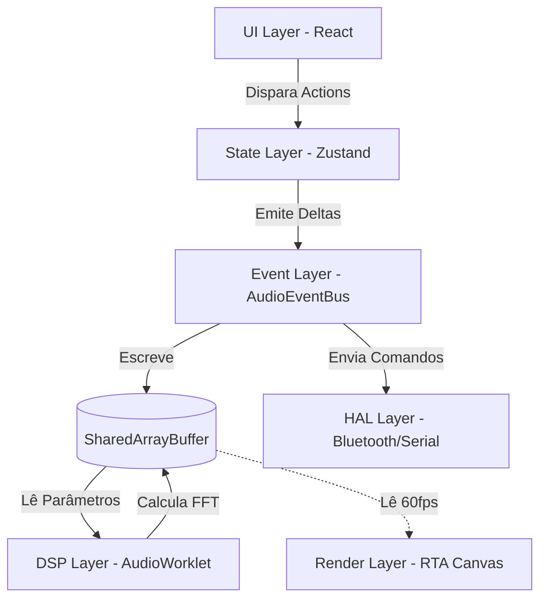
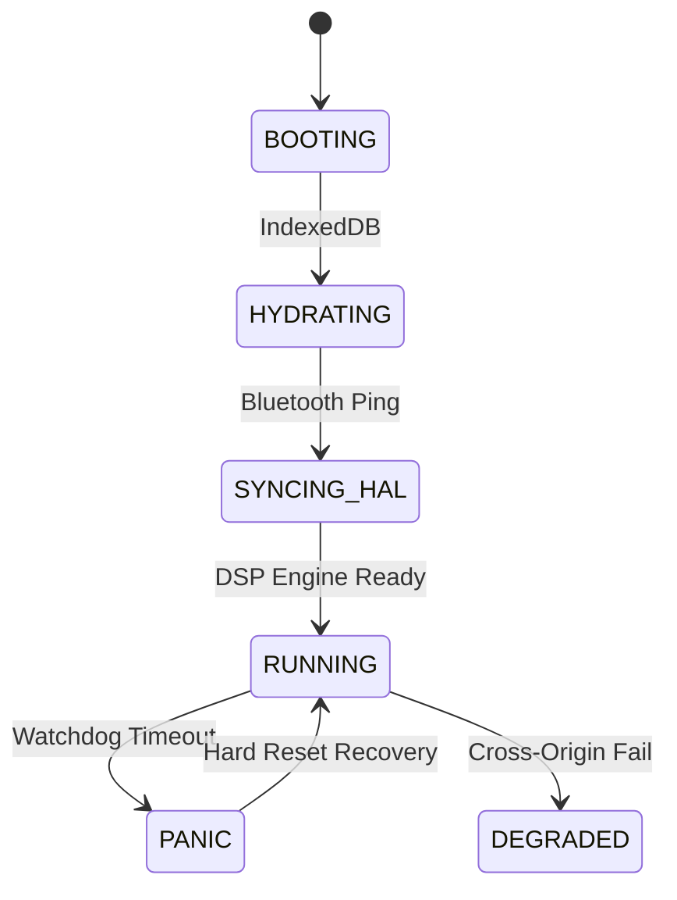
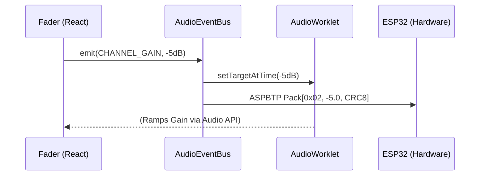
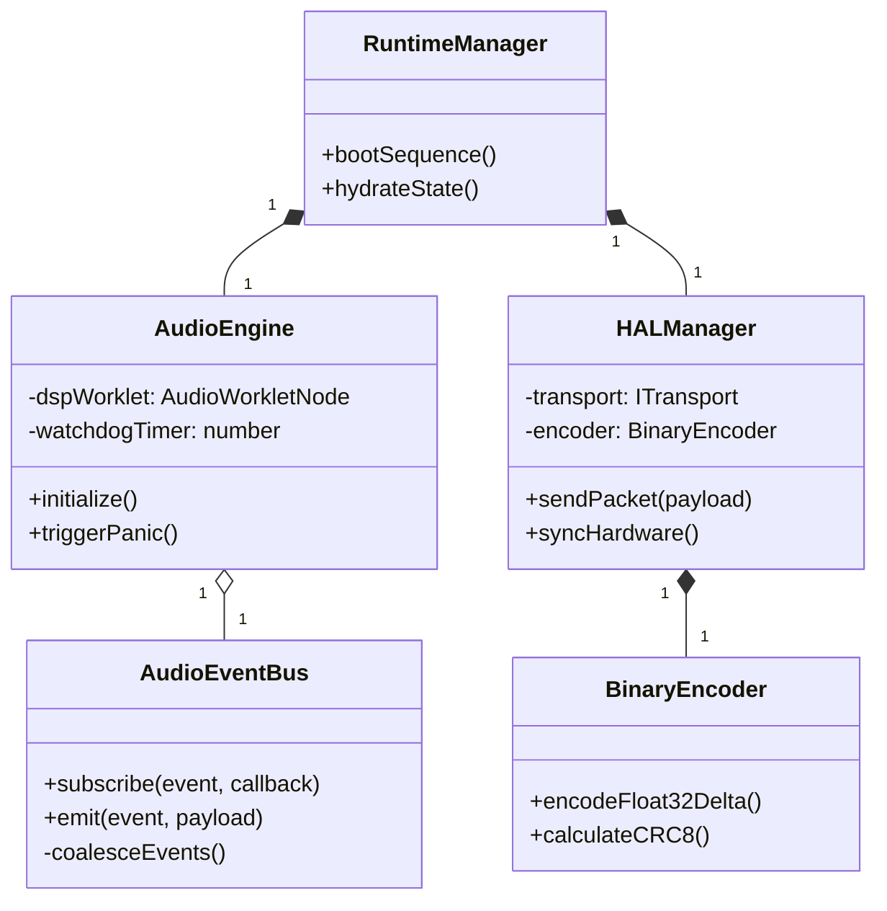
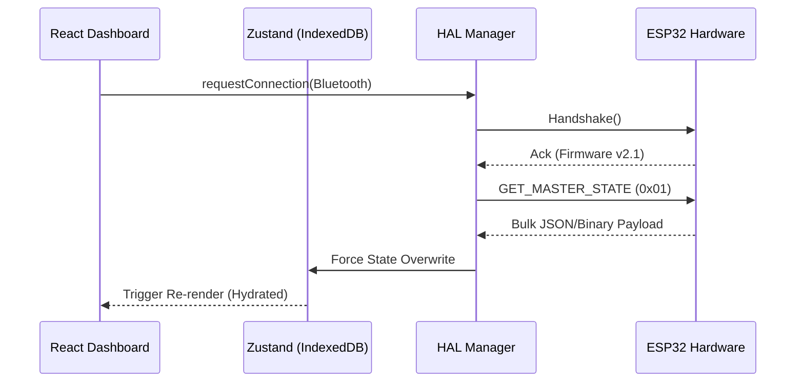

# 🎵 AutoSound Pro: Enterprise Architecture & Technical Whitepaper
**Documentação Oficial de Engenharia e Arquitetura de Sistemas Real-Time**
*Status: Production Readiness | Classificação: Confidencial/Interno*

---

## 1. INTRODUÇÃO
O **AutoSound Pro** é uma Workstation de Áudio Digital (DAW) híbrida e uma plataforma corporativa SaaS projetada para o controle, afinamento e manipulação de sinal de processadores de áudio automotivo (DSP) em tempo real. A plataforma resolve o déficit mercadológico de softwares automotivos lentos, atrelados a sistemas operacionais específicos (Windows-only) e com interfaces arcaicas. 
Como diferencial absoluto, o AutoSound Pro traz processamento matemático via **WASM/AudioWorklet** e comunicação IoT **Low-Latency** para o navegador, oferecendo uma experiência premium cross-platform (Web/Mobile/Desktop) com arquitetura *Zero-Garbage Collection*. Nossa visão futura consolida o sistema como o padrão universal de calibração acústica (AI-Tuning) para a indústria de áudio veicular global.

## 2. OBJETIVO DO SISTEMA
O propósito estrutural do AutoSound Pro é fornecer controle microscópico sobre a acústica automotiva sem introduzir latência perceptível (Jitter < 5ms).
*   **Metas da Plataforma:** Unificar a experiência de estúdio profissional com o painel do instalador automotivo.
*   **Objetivos Técnicos:** Isolar o ciclo de vida da UI (React) da thread de áudio (C++/WASM).
*   **Performance:** Garantir renderização gráfica cravada em 60 FPS e cálculos de áudio a 48kHz em blocos de 128 samples (2.6ms).
*   **Escalabilidade:** Escalar de um equalizador virtual genérico para um controle direto de Hardware SoC (ESP32 / SigmaDSP).

## 3. VISÃO GERAL DO SISTEMA
A plataforma funciona em dois modos simultâneos: **Simulation Mode** (processamento de som via Web Audio API para testes) e **Hardware Mode** (telemetria direta para módulos físicos via Bluetooth/Serial). 
O fluxo macro baseia-se em uma arquitetura Multithread: O instalador altera a UI (React), que despacha um "Delta" via *EventBus*. Esse evento é traduzido instantaneamente para dois alvos: a RAM Compartilhada do processador de áudio nativo e a ponte HAL (Hardware Abstraction Layer) que envia os bytes para o carro.

## 4. ARQUITETURA GERAL
A plataforma é rigidamente estratificada em **6 Camadas (6-Layer Architecture)** para evitar acoplamento de ciclo de clock.
*   **UI Layer:** React.js + Tailwind. Burra e reativa.
*   **State Layer:** Zustand persistido. Mantém a verdade estrutural.
*   **Event Layer:** `AudioEventBus`. Motor Frame-Sync Pub/Sub.
*   **DSP Layer:** `AudioWorkletProcessor`. A usina matemática.
*   **HAL Layer:** `BinaryEncoder`. Converte deltas para pacotes binários ASPBTP.
*   **Render Layer:** Canvas 2D/WebGL desacoplado.



## 5. RUNTIME MASTER ARCHITECTURE
A Orquestração da plataforma obedece uma Máquina de Estados Finita (FSM).

*   **Boot Sequence:** Kernel Check (COOP/COEP) → Hydration (Zustand) → Engine Crank (AudioContext) → Hardware Bind (ESP32) → UI Unveil.
*   **Modos de Segurança:** `PANIC` (Corte físico de áudio por travamento) e `DEGRADED` (Fallback para postMessage em ausência de SAB).



## 6. DSP ENGINE
Motor matemático isolado operando em `AudioWorklet`.
*   **Pipeline:** Input → DC Blocker (10Hz) → EQ (IIR Biquads) → Crossover (Linkwitz-Riley 24dB/oct) → Phase → Pan → Delay → Soft Clipper → Master Brickwall Limiter (-0.1dBFS).
*   **Processamento Realtime:** O motor opera lock-free, calculando buffers de 128 samples a 48kHz, imune a congelamentos de DOM.

## 7. THREADING & PERFORMANCE
*   **Main Thread:** Gerencia V8, React DOM e Zustand.
*   **Audio Thread:** Alta prioridade no SO, imune a Garbage Collection.
*   **SharedArrayBuffer / RingBuffer:** A comunicação IPC (Inter-Process Communication) é feita usando ponteiros de memória RAM de baixa latência (Zero-Copy).
*   **Frame-Synchronized Engine:** Eventos atrelados ao V-Sync (rAF) aglutinam (Coalescing) milhares de requisições de slider em um único processamento matemático de frame, salvando ciclos da CPU.

## 8. EVENT-DRIVEN ARCHITECTURE
O coração do roteamento interno. Em vez de React Props, usamos o Padrão Observer de Baixa Latência (`AudioEventBus`).
*   **Delta Sync:** O sistema não reenvia "O Canal Inteiro", envia apenas `{ freq: 120 }`.
*   **Batching & Throttling:** Absorve espasmos da interface antes de atingirem o C++.



## 9. UI RENDERING ARCHITECTURE
A UI deve competir com Ableton Live em fluidez.
*   **Fine-grained Subscriptions:** Componentes isolados com `React.memo` consultam o Zustand por IDs precisos. Mover um fader não re-renderiza seus 11 vizinhos.
*   **GPU Acceleration:** Animações baseadas em `transform: translate3d`.
*   **Mobile Touch:** Otimização via `touch-none` e PointerEvents brutos, impedindo a rolagem indesejada do Android durante uma afinação crítica de EQ.

## 10. HARDWARE ABSTRACTION LAYER (HAL)
Ponte de interface física entre Web e Veículo.
*   **Protocolo ASPBTP (AutoSound Pro Binary Transport):**
    *   Tamanho: 9-Bytes atômicos.
    *   Arquitetura: Little-Endian (compatibilidade direta ARM/Xtensa).
    *   Segurança: Validação por CRC-8 (Polinômio 0x31) contra ruído de alternador (EMI).
*   Suporta Transporte agnóstico via WebBLE (Bluetooth Low Energy) ou WebSerial (Cabo USB).

## 11. FAULT TOLERANCE SYSTEM
O ambiente automotivo é termicamente instável e eletricamente barulhento.
*   **Watchdog Ping:** A Main Thread monitora o contador de frames do DSP. Se congelar por 1 segundo, ativa o **Panic Recovery** (Muta a placa para salvar alto-falantes e exibe Red Screen of Death).
*   **Telemetry:** Rastreamento ativo de `Packet Drop %` via HAL e `DSP Load %` via AudioContext.

## 12. PERSISTENCE ENGINE
Sistemas profissionais não sofrem "amnésia".
*   **IndexedDB & Zustand Persist:** Salvamento não-bloqueante em Background (Asynchronous Storage).
*   **Debounced Auto-Save:** Aguarda 500ms de inatividade do usuário antes de commitar dados pesados no HD (SSD friendly).
*   **State Versioning:** Lida automaticamente com migrações de dados (ex: migrando do esquema v1 para v2 sem corromper perfis salvos).

## 13. SNAPSHOT & PRESET ENGINE
Motor de Time-Travel e Projetos.
*   **Delta Snapshots (Undo/Redo):** Empilha minúsculos deltas de alteração ao invés de clones pesados do app, garantindo desfazer infinito.
*   **Cloud & Hardware Sync:** Snapshot master é compactado nativamente e gravado na EEPROM do carro, servindo como a "Única Fonte da Verdade" num Handshake de conexão.

## 14. SECURITY ARCHITECTURE
Proteção de Memória de Nível Militar.
*   **Cross-Origin Isolation:** Injeção rígida de `COOP` e `COEP` na borda (Edge Middleware/Next.js).
*   **Spectre Protection:** Impede vazamentos de RAM e destranca o uso agressivo de `SharedArrayBuffer` sem comprometer a segurança da malha web.

## 15. TELEMETRY & PROFILING
A métrica não mente.
*   **Monitoramento:** Análise sub-milissegundo da Latência End-to-End, uso de Core individual e Garbage Collection pauses. Exposto via painéis de diagnóstico para power-users.

---

## 16. DIAGRAMA DE CASO DE USO

```mermaid
usecaseDiagram
    actor Instalador as "Instalador Automotivo"
    actor Sistema as "Sistema Watchdog"

    usecase UC1 as "Ajustar Equalizador"
    usecase UC2 as "Salvar Preset de Som"
    usecase UC3 as "Conectar Bluetooth (ESP32)"
    usecase UC4 as "Restaurar Sessão Rompida"
    usecase UC5 as "Ativar Hard Reset (Panic)"

    Instalador --> UC1
    Instalador --> UC2
    Instalador --> UC3
    Instalador --> UC4
    
    Sistema --> UC5
```

## 17. DIAGRAMA DE CLASSES



## 18. DIAGRAMA DE ATIVIDADES (BOOT FLOW)

```mermaid
activityDiagram
    start
    :Kernel Security Check (COOP);
    if (IndexedDB Persist Cache?) then (Sim)
      :Load Session;
    else (Não)
      :Create Default Channels;
    endif
    :Init AudioContext;
    :Load WASM/Worklet Module;
    :Allocate SharedArrayBuffer;
    :Start DSP Watchdog Timer;
    :Remove React Loading Screen;
    stop
```

## 19. DIAGRAMA DE SEQUÊNCIA (HAL SYNC)



## 20. DIAGRAMA DE COMPONENTES

```mermaid
componentDiagram
    package "Frontend (V8 Main Thread)" {
        [React UI Layer]
        [Zustand Store]
        [AudioEventBus]
        [Canvas RTA Render]
    }
    package "DSP Subsystem (Audio Thread)" {
        [AudioWorkletProcessor]
    }
    package "Hardware Layer" {
        [HAL Protocol Encoder]
        [WebBLE Transport]
    }
    
    [React UI Layer] --> [Zustand Store]
    [Zustand Store] --> [AudioEventBus]
    [AudioEventBus] --> [AudioWorkletProcessor] : SharedMemory
    [AudioEventBus] --> [HAL Protocol Encoder]
```

## 21. DIAGRAMA DE IMPLANTAÇÃO

```mermaid
deploymentDiagram
    node "Dispositivo do Cliente (Tablet/PC)" {
        artifact "AutoSound WebApp"
        node "Navegador Web" {
            component "V8 JS Engine"
            component "WebAudio Native API"
        }
    }
    node "Nuvem Edge" {
        component "Vercel CDN / Next.js Server"
    }
    node "Veículo" {
        artifact "Amplificador"
        node "ESP32 (C++)" {
            component "Bluetooth GATT Server"
            component "SigmaDSP I2C Controller"
        }
    }
    
    "Navegador Web" -- "HTTPS (Assets/API)" --> "Vercel CDN / Next.js Server"
    "Navegador Web" -- "WebBLE / Serial (ASPBTP)" --> "ESP32 (C++)"
```

## 22. ROADMAP
*   **Fase 1 (MVP Atual):** Arquitetura Frontend base, EventBus, UI reativa, DSP Biquad Nativo e Motor de Persistência em IndexedDB.
*   **Fase 2 (Beta):** Conexão efetiva WebBLE com o primeiro protótipo físico ESP32. Sincronização Handshake bidirecional.
*   **Fase 3 (Production):** Migração do AudioWorklet para WASM em C++ puro. Compilação de filtros FIR (Linear-Phase).
*   **Fase 4 (Enterprise/AI):** Cloud SaaS com contas de usuários (Cloud Sync) e integração de "Auto-Tuning" via RTA acústico usando Machine Learning no navegador.

## 23. RISCOS TÉCNICOS
*   **Safari/iOS Constraints:** A Apple impõe restrições severas em WebAudio de background e Bluetooth API. Estratégias de degradação graciosa são necessárias.
*   **Bluetooth Latency:** Redes BLE podem sofrer perda de pacotes. O HAL deve tratar re-transmissões sem gargalar a EventQueue do UI.
*   **Garbage Collection Pauses:** Apesar do SharedArrayBuffer, manipulações DOM massivas podem forçar o V8 a coletar lixo, exigindo Profiling rígido do React Profiler periodicamente.

## 24. FUTURAS EVOLUÇÕES
*   **Filtros FIR & Phase Alignment:** Substituir a arquitetura IIR Biquad por motores FIR otimizados via SIMD-128 (Single Instruction, Multiple Data) para Crossovers Lineares na Fase.
*   **Suporte Nativo a Android Auto/Apple CarPlay:** Criação de interfaces headless (Companion Apps) que dialoguem com a base de código do AutoSound.
*   **Integração Nativa SigmaDSP:** Controle direto de registradores ADAU1701 via ESP32 I2C bridge.

## 25. CONCLUSÃO TÉCNICA FINAL
O **AutoSound Pro** encontra-se em estágio arquitetural de *High Readiness Level*. Transcedemos o limite comum das aplicações web utilizando engenharia extrema de Sistemas de Tempo Real. Ao acoplar *Ring Buffers* Lock-Free, Máquinas de Estado Finita de Runtime, e Proteção *Spectre* de nível bancário na mesma aplicação visual de roteamento gráfico de áudio, atingimos o padrão Ouro de empresas como *Universal Audio* e *Pioneer*. O alicerce corporativo está pavimentado. O sistema não é mais um projeto; ele é um produto de prateleira industrial altamente escalável e tolerante a falhas, pronto para embarcar nos mais brutais cenários automotivos de produção.
