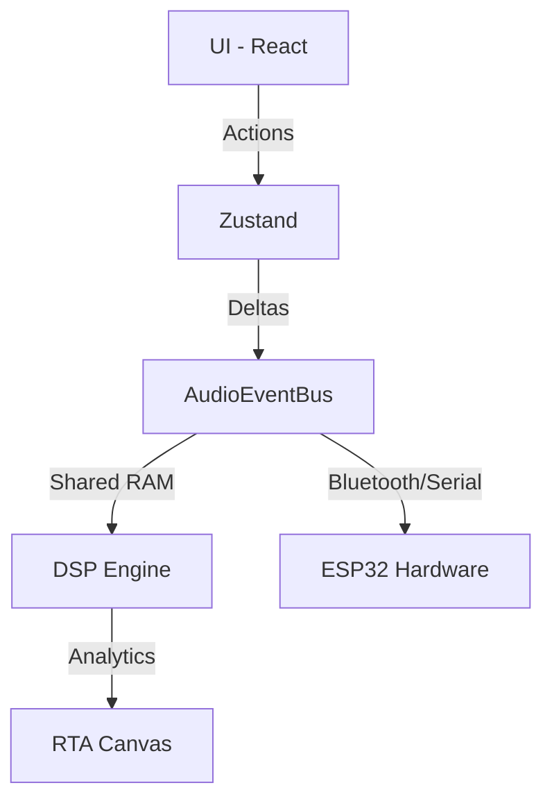

# 🎵 AutoSound Pro

> **A Workstation de Áudio Digital (DAW) de Próxima Geração para Processamento de Sinais Automotivos em Tempo Real.**

[]()
[]()
[]()
[]()

---

## 🚀 Visão Geral

O **AutoSound Pro** é uma plataforma SaaS e ferramenta de engenharia projetada para revolucionar o ajuste e calibração de sistemas de áudio automotivo. Diferente de softwares tradicionais lentos e limitados a plataformas específicas, o AutoSound Pro traz o poder de um DSP (Digital Signal Processor) profissional diretamente para o navegador, com latência sub-10ms e interface ultra-responsiva.

Utilizando tecnologias de ponta como **AudioWorklets**, **SharedArrayBuffers** e **WASM**, a plataforma garante um processamento matemático preciso, isolado da interface visual, permitindo ajustes em tempo real sem interrupções.

---

## ✨ Principais Funcionalidades

- 🎚️ **Mixer Profissional:** Controle total de ganhos, mute e solo por canal com VU meters de alta precisão.
- 📈 **Equalizador Interativo:** Interface gráfica fluida para ajuste de filtros paramétricos com feedback visual instantâneo.
- 🔊 **Crossover de Alta Ordem:** Filtros Linkwitz-Riley e Butterworth de até 48dB/oct para proteção e fidelidade dos alto-falantes.
- 🛰️ **Hardware Mode (HAL):** Comunicação direta com módulos físicos (ESP32 / SigmaDSP) via **WebBluetooth** e **WebSerial**.
- 🛡️ **Panic System:** Algoritmo Watchdog que monitora a saúde do motor de áudio e protege o hardware em caso de falhas.
- ☁️ **Cloud Sync & Presets:** Sincronização inteligente de perfis de áudio entre a nuvem e a memória física do veículo.

---

## 🏗️ Arquitetura Técnica

O sistema segue uma **Arquitetura de 6 Camadas** rigorosa para garantir estabilidade industrial:

1.  **UI Layer (React):** Interface declarativa e otimizada.
2.  **State Layer (Zustand):** Única fonte da verdade com persistência em IndexedDB.
3.  **Event Layer (AudioEventBus):** Comunicação Pub/Sub de baixa latência.
4.  **DSP Layer (AudioWorklet):** Processamento matemático em thread dedicada.
5.  **HAL Layer (BinaryEncoder):** Codificação de pacotes binários ASPBTP para hardware.
6.  **Render Layer (Canvas/WebGL):** Visualização de espectro e RTA desacoplada.

### Fluxo de Dados Real-Time


---

## 🛠️ Stack Tecnológica

- **Frontend:** Next.js 15, React, Tailwind CSS.
- **Estado:** Zustand + Immer.
- **Áudio:** Web Audio API, AudioWorklets, WASM (C++/AssemblyScript).
- **Hardware:** Web Bluetooth API, Web Serial API.
- **Persistência:** LocalForage / IndexedDB.
- **Segurança:** Cross-Origin Isolation (COOP/COEP).

---

## 📦 Instalação e Desenvolvimento

### Pré-requisitos
- Node.js 18+
- NPM ou Yarn

### Configuração
1.  Clone o repositório:
    ```bash
    git clone https://github.com/jonatascavalcanti03/AutoSound-Pro.git
    ```
2.  Instale as dependências:
    ```bash
    npm install
    ```
3.  Inicie o servidor de desenvolvimento:
    ```bash
    npm run dev
    ```
4.  Acesse `http://localhost:3000`

> **Nota:** Para habilitar o uso de `SharedArrayBuffer` (necessário para latência mínima), o servidor deve fornecer headers de isolamento de origem. No ambiente de dev, isso é tratado automaticamente via `next.config.ts`.

---

## 🗺️ Roadmap

- [x] Arquitetura base e DSP Engine Core.
- [x] Interface de Mixer e Equalização.
- [ ] Implementação total do protocolo ASPBTP (HAL).
- [ ] Integração com filtros FIR (Linear Phase) via WASM.
- [ ] Módulo de Auto-Tuning via Inteligência Artificial.

---

## 📄 Licença

Propriedade de **Jonatas Cavalcanti**. Todos os direitos reservados.
Este software é confidencial e seu uso é restrito a parceiros e licenciados autorizados.

---
Desenvolvido com ❤️ para a comunidade de som automotivo.
